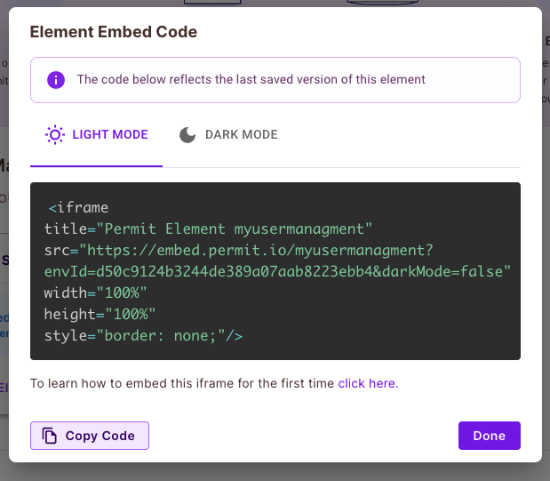

# Getting Started with Create React App

This project was bootstrapped with [Create React App](https://github.com/facebook/create-react-app).

This project is a simple react app that uses the [Permit Elements]( user-management, audit log, access request,
operation approval and approval-management) to test with cypress the use of the Permit Elements.

## frontend
### `cd src`
### `yarn`
### `yarn start`

run app in development mode.

## backend in /server
### `cd server`
### `yarn`
### `yarn start` or `yarn dev` (nodemon)

## ENV VARS
replace .example.env - > .env
Don't forget to put your details there

## embedded iframe
To get the embedded iframe, you need to go to the Permit Elements page and get the embedded iframe code.

Then, place the code in the `src/components/EmbedElement.tsx` file in the relevant place.

